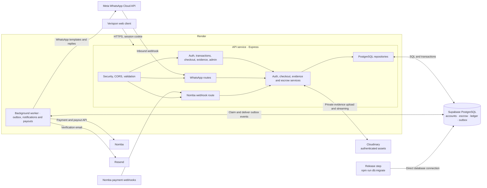

# Verispon Backend

Node.js 22+ / TypeScript / Express backend for the Verispon web and WhatsApp clients. Both channels call the same services and escrow engine. The API is designed for Render, Supabase PostgreSQL and private Cloudinary evidence storage.

## Architecture



The web client and WhatsApp bot share the same backend services and escrow rules. The API writes notification and provider work to PostgreSQL's outbox; the separate worker processes it and calls the relevant provider. Database migrations run as a release step using the direct PostgreSQL connection, while the API and worker use the Supabase pooler.

## Local setup

1. Install Node.js 22 or later.
2. Copy `.env.example` to `.env` and set a random `SESSION_SECRET` of at least 32 characters.
3. Point the project at Supabase Postgres, using the steps below, and set the Cloudinary keys for evidence uploads.
4. Install dependencies and apply migrations:

   ```powershell
   npm install
   npm run db:migrate
   npm run dev
   ```

5. The API listens on `http://localhost:4000`; liveness is `/health` and readiness is `/health/ready`.
6. Run `npm test` and `npm run build` before deploying.

`/health/ready` stays `503` until the database, all twelve migrations and Cloudinary credentials are present, so it doubles as the check that this wiring is complete.

## Database setup

Supabase supplies the PostgreSQL database, and it is the only thing in this service that
talks to Supabase. Evidence files live in Cloudinary; see the storage section below.

**Database.** Panel > Settings > Database > Connection string. There are two, and they are
not interchangeable:

| String | Where | Why |
| --- | --- | --- |
| Direct (`db.<ref>.supabase.co:5432`) | `npm run db:migrate` only | The runner takes a session-scoped advisory lock so two deploys cannot apply the same migration. A pooler releases the session between statements, so the lock would silently not be held. `scripts/migrate.ts` refuses a pooler host outright. |
| Pooler (`<region>.pooler.supabase.com:6543`) | the running API and worker | The connection budget is shared with the dashboard and every other client. This service opens up to 10 connections per process across two processes. |

Use `?sslmode=verify-full` on both. `require` is verified today, but pg-connection-string
warns that it stops being verified in pg v9.

Swap the URL between the two before and after migrating:

```powershell
# direct string
$env:DATABASE_URL='postgresql://postgres:<password>@db.<ref>.supabase.co:5432/postgres?sslmode=verify-full'
npm run db:migrate

# pooler string for normal running
$env:DATABASE_URL='postgresql://postgres.<ref>:<password>@<region>.pooler.supabase.com:6543/postgres?sslmode=verify-full'
npm run dev
```

Migration 001 enables `pgcrypto` and `citext`. Both are available to the `postgres` role, so
the runner creates them itself. If the dashboard lists them as not enabled, enable them under
Database > Extensions first rather than editing the migration.

## Evidence storage

Evidence uploads go to **Cloudinary**. Supabase supplies the database only.

Cloudinary is a public CDN, so the default behaviour — upload to `res.cloudinary.com`
and hand out the URL — would publish the photographs and video that a dispute is
decided on. Three things prevent that:

1. Uploads set `type=authenticated`, so the asset is not addressable by a plain
   delivery URL.
2. Reads are signed with the API secret. `tests/object-storage.test.ts` pins the
   algorithm against Cloudinary's own published test vector, because the scheme is
   `sha1(path + api_secret)` truncated to eight URL-safe base64 characters and a
   silent error here is a broken download rather than a visible failure.
3. **The signed URL is never given to a client.** Cloudinary derives the delivery
   signature only from the path and the secret — there is no expiry in the scheme —
   so a signed URL is a permanent credential for that asset. `GET
   /api/evidence/:transactionId/:file` re-checks party membership and streams the
   bytes. Turning that into a redirect to Cloudinary would hand every viewer a
   permanent link to the evidence.

Reads are streamed rather than buffered. Evidence accepts 25 MB videos, and
buffering them in the API process is how a few concurrent downloads exhaust memory
on a small instance.

Addressing is stateless: the public id is the storage key plus an extension derived
from the sniffed content type, so upload and download agree without a mapping table
and a row written before a deploy still resolves.

Set `CLOUDINARY_CLOUD_NAME`, `CLOUDINARY_API_KEY` and `CLOUDINARY_API_SECRET` from
the console's API keys page. The API secret must never reach the browser or Netlify.
`/health/ready` stays `503` until all three are present, so a deploy that forgot them
is caught by the readiness probe rather than by a failed dispute upload.

The API process and worker are separate. To run a worker locally, set `ENABLE_WORKERS=true` in `.env`, then start `npm run worker` in a second terminal. Do not run workers in multiple API instances unless each has a single worker process configured intentionally; the outbox uses PostgreSQL row locks to allow multiple workers safely.

## Deployment

- Deploy the API as a Render web service with build command `npm ci && npm run build` and start command `npm start`.
- Deploy a separate Render background worker with build command `npm ci && npm run build` and start command `npm run worker`. Set `ENABLE_WORKERS=true` only on this service.
- Use the Supabase **direct** database URL for migrations when possible. Use the Supabase pooler URL for Render runtime if direct connections exceed the project connection budget. Keep SSL enabled in production.
- Set `WEB_ORIGIN=https://verispon.com` and `API_ORIGIN=https://api.verispon.com`. The frontend must send credentialed API requests; browsers only attach the session cookie to requests when configured with credentials.
- Configure Cloudflare DNS/TLS for `api.verispon.com` to the Render service. Keep HTTPS enforced and do not cache `/api/*` responses.
- Set `DATABASE_URL`, `SESSION_SECRET`, `CLOUDINARY_CLOUD_NAME`, `CLOUDINARY_API_KEY` and `CLOUDINARY_API_SECRET` on both Render services. Never expose the Cloudinary API secret or provider credentials to Netlify.
- Set `AUTO_RELEASE_HOURS` only after the product owner has chosen the inspection window. If unset, inspection deadlines are not assigned and auto-release is disabled.
- Run `npm run db:migrate` as a release step after deployment secrets are present and before switching production traffic.

## Provider setup

Nomba webhooks:

- Configure `POST https://api.verispon.com/api/internal/nomba/webhook` in the Nomba dashboard.
- Configure the same webhook signature secret in `NOMBA_WEBHOOK_SECRET`.
- Subscribe to `payment_success`, `payout_success`, and `payout_refund` events. Payment success is re-queried from Nomba and checked against the exact expected kobo total before funding escrow.
- Start with `NOMBA_API_BASE_URL=https://sandbox.nomba.com`; use `https://api.nomba.com` only with production credentials after sandbox verification.

Meta WhatsApp:

- Configure `GET` and `POST https://api.verispon.com/api/whatsapp/webhook` with the verify token and app secret.
- Inbound messages are verified using `X-Hub-Signature-256` over the raw request body and deduplicated by Meta message ID. `STOP` opts out; `START` opts back in. `HELP`, `STATUS`, `LIST`, `FEE`, and `LINK` are read-only commands; `CONFIRM` and `DISPUTE` delegate to the existing escrow service.
- Replies and notifications are delivered through the outbox. Evidence media received in chat is not uploaded; users are directed to the authenticated dashboard. Location pins are echoed for review but never saved by the bot.
- The 24-hour free-form window is based on the latest signed inbound message timestamp, persisted in `accounts.last_whatsapp_inbound_at` by migration 012. Outside that window, the worker uses a registered template instead of retrying rejected free-form sends.
- The template registry uses English templates. Create and obtain Meta approval for these exact names and body parameter counts before production sends outside the service window:
  - `verispon_account_update` (0): “You have a Verispon update. Open WhatsApp to view it.”
  - `verispon_opt_out_confirmation` (0): “WhatsApp notifications are now turned off for this account.”
  - `verispon_payment_ready` (1): “Complete your Verispon payment securely: {{1}}”
  - `verispon_payout_requested` (1): “Payout for {{1}} has been requested and is being processed.”
  - `verispon_payout_returned` (1): “Payout for {{1}} returned to Verispon. Update your verified payout details or contact support.”
  - `verispon_refund_update` (1): “Refund request for {{1}} was submitted to the payment provider. Check your account for the outcome.”
  - `verispon_transaction_funded` (1): “The buyer has paid for {{1}}. Prepare the item in Verispon.”
  - `verispon_transaction_disputed` (1): “A dispute has been opened for {{1}}. This pauses payout; it is not a refund.”
  - `verispon_transaction_update` (2): “Transaction {{1}} is now {{2}}.”
  - `verispon_verification_code` (2) and `verispon_recovery_code` (2): “Your Verispon code is {{1}}. It expires in {{2}}.”
- Transaction notifications require stored WhatsApp consent and every outbound WhatsApp send checks opt-out status. Recovery, verification, and in-window replies are sent only when the account has not opted out. If outbound Meta credentials are missing, inbound webhooks still acknowledge safely; queued WhatsApp sends are skipped and logged rather than retried as errors.

Resend:

- Verify the sender domain, then set `RESEND_API_KEY` and `RESEND_FROM_EMAIL`.
- Email is used for account verification and as a fallback when a user has no WhatsApp consent.

## API surface

- `POST /api/auth/register`, `/login`, `/logout`, `/recover`, `/recover/verify`
- `POST /api/auth/verification/send`, `/verification/confirm`
- `POST /api/auth/whatsapp-consent`, `/whatsapp-opt-out`; `GET /api/auth/me`
- `GET|POST /api/transactions`; `GET /api/transactions/:id`
- `POST /api/transactions/:id/transition`, `/evidence`, `/dispute`, `/dispute/response`
- `GET|DELETE /api/transactions/:id/evidence` (`DELETE` takes `?evidenceId=`)
- `GET /api/evidence/:transactionId/:file`
- `GET /checkout/:token` — **no session**, the token is the credential
- `GET|PUT /api/accounts/payout-destination`
- `GET /api/admin/disputes`, `/transactions`, `/accounts`, `/audit`
- `POST /api/admin/disputes/:id/review`, `/disputes/:id/resolve`
- `POST /api/admin/accounts/:id/freeze`, `/accounts/:id/unfreeze`
- `POST /api/admin/refunds/:id/reconcile`
- `GET|POST /api/whatsapp/webhook`; `POST /api/internal/nomba/webhook`

JSON uses snake_case and integer `*_kobo` money. Every user mutation requires
`Idempotency-Key`; omitting it is a `400`, while reusing a key with a different
body is a `409`. The API uses `401` for unauthenticated requests, `404` for
non-party resource reads, `403` for missing capabilities, `409` for
idempotency and transition conflicts, and `422` for validation errors.

If `DATABASE_URL` is unset the API starts and serves `/health`, but every `/api`
route answers `503 NOT_CONFIGURED` rather than a `404`, so a missing variable is
not mistaken for a bad path.

### Dispute resolution is two steps

`POST /api/admin/disputes/:id/review` moves a `DISPUTED` transaction to
`UNDER_REVIEW` and is idempotent. `POST /api/admin/disputes/:id/resolve` requires
`UNDER_REVIEW`. Both are keyed by **dispute** id; the routes resolve it to the
transaction before calling the engine. Without the review step, resolution would
be unreachable, because `UNDER_REVIEW` is engine-only and no client can reach it.

## Linking the frontend

The frontend must send `credentials: 'include'` on every request, because auth
rides on the `verispon_session` cookie. Both sides read and write the same cookie
name with the same `SESSION_SECRET`, so a session issued by either is valid at
the other.

Two contract details are easy to get wrong:

- Money is an integer count of kobo in fields named `*_kobo`. The frontend's
  domain types use camelCase `amountKobo`; convert at the repository boundary
  rather than renaming types.
- Errors are `{ "error": { "code", "message" } }`, an object. Reading `error` as
  a string renders `[object Object]` on every failure.

The frontend's dashboard reads currently bypass HTTP and call its own JSON
repository in process. Pointing writes at this API without also replacing that
repository will leave every read showing stale or empty data.

To bootstrap an admin after migrations, create a normal account, then run the operator command from a secure machine with production database access:

```powershell
npm run admin:grant -- <account-uuid> disputes.read disputes.resolve transactions.read_all accounts.read accounts.freeze audit.read
```

The grant script assigns `ADMIN` out of band and writes an audit record. To revoke capabilities, run `npm run admin:revoke -- <account-uuid> disputes.resolve audit.read`; removing the last capability also removes the `ADMIN` role. Do not grant capabilities through account registration or frontend requests.

## Money and release gates

- All domain amounts are `bigint` kobo. Naira decimal formatting exists only in the Nomba adapter.
- The current fee policy is 2% buyer / 1% seller, rounded half-up and capped at 1,000,000 kobo per side.
- The current refund implementation retains the buyer fee and refunds principal only. This is an explicit provisional choice from the design; confirm it with the business owner before production. The retained fee is reclassified from `buyer_fee_revenue` to `platform_equity` in the same balanced posting, so it is reported as earned rather than left as an undischarged obligation.
- A release requires a verified seller payout destination. `RELEASED` means payout authorized; only verified Nomba payout settlement moves the state to `COMPLETED`.
- If Nomba accepts a refund request but the connection fails before Verispon receives the response, the attempt is quarantined and never resent automatically. An operator with `refunds.reconcile` must check Nomba's dashboard and call `/api/admin/refunds/:id/reconcile` with the confirmed outcome.
- Nomba checkout, bank-name lookup, bank transfer, signed payment/payout webhooks, outbox notifications, private evidence storage, and the inspection auto-release engine are implemented. Do a sandbox end-to-end test with Nomba before enabling live credentials.
- Dispute resolution does not time out or auto-release. The auto-release worker locks the transaction and rechecks open disputes in the same database transaction.
- The transition engine derives the caller's role from the transaction row, so a seller's own actions are never refused for a role the route guessed, and a buyer cannot reach a seller-only state.
- Row level security is enabled with an explicit permissive policy per table. Authorization is enforced in the service layer, so these policies exist to keep behaviour independent of table ownership rather than to add a second boundary. A permissive policy is only safe while this backend is the only database client, so do not add a direct-to-Supabase frontend before replacing them with per-user policies.
- Integrated courier events and rider identity are not implemented. `INTEGRATED_COURIER` must remain unavailable.
- Migrations through `010_rls_policies.sql` have been applied and verified against PostgreSQL 17, and the full registration to dispute-resolution path has been exercised over HTTP. Migrations 011 and 012 were added afterward and still need to be applied and verified in the target database before deployment. Anything behind a real provider—Nomba checkout and settlement, WhatsApp delivery, and Resend email—also remains unverified and requires live credentials.
- Migration `011_condition_photos_and_checkout.sql` adds `photos_enabled`, the three `checkout_*` columns and the missing `verispon_escrow_bank` ledger account. Migration `012_whatsapp_last_inbound.sql` adds the timestamp used to enforce the WhatsApp 24-hour service window. Run `npm run db:migrate` against the target database before starting the API; readiness stays `503` until all twelve migrations are applied.
- Every transaction is issued a checkout token at creation: 32 lowercase hex characters, fixed 24-hour deadline, never rotated and never extended. `GET /checkout/:token` is the only unauthenticated read in the API, it cannot mark a transaction paid, and it returns no counterparty name, reference, phone or address. A malformed token is a `404` and never reaches the database.
- `photos_enabled` gates the move into `AWAITING_PAYMENT` on an `ITEM_BEFORE_TRANSACTION` upload. The flag is written once at creation by the server; a client can turn it on but cannot turn a gate off.
- Cancelling a `FUNDED` transaction is a refund, not a withdrawal. Only the buyer may take that path, because a seller who could cancel a funded transaction would keep the principal without ever shipping. Evidence is sealed at `RELEASED` and `COMPLETED` — no upload and no removal.
- `docs/` is a copy of the spec for the frontend repository (`apps/web/src/*`, a Next.js app), not this service. Several of its claims are false against this codebase — it says idempotency, the banking webhook, the WhatsApp webhook and auto-release do not exist, and all four are implemented here. Treat the code as the contract unless a specific change is being ported deliberately.